# rabbitMq-redis
## 一、rabbitMq

### 1.作用

作用：解决高并发，达到高可用

### 2.消息队列

> ​	MQ(Message Queue)：是在消息传递的过程中保存消息的容器。多用于分布式系统之间的通信。

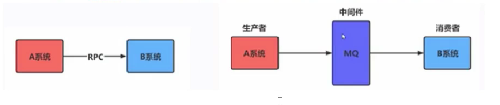

### 3.应用场景

#### 3.1.削峰填谷

> ​	比如：天猫双11，订单量剧增，就会导致库存系统并发量增加。
>
> ​	解决方法：订单系统和库存系统中间加一个MQ(消息中间件)，订单系统生成的数据发送到MQ中，库存系统每次从MQ中取1000条数据就行处理，做到削峰填谷【削峰填谷是对库存系统或者物流系统】

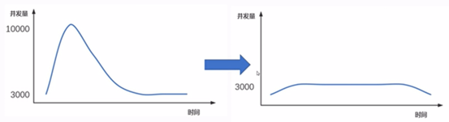

#### 3.2.应用解耦

分布式系统多个系统之间会存在一个问题：耦合度高、容错性低、可维护性差、用户体验差

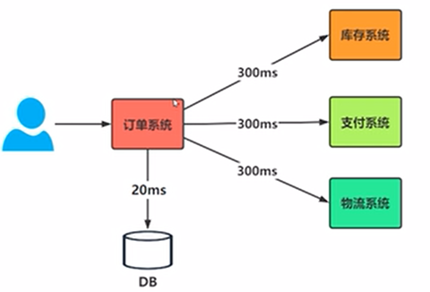

解决：耦合度低、容错性高、可维护性好、用户体验好

> ​	订单系统那里加一个MQ

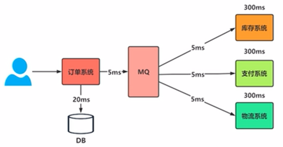

#### 3.3.异步处理

如应用解耦的解决图，订单系统那里加一个MQ，库存系统、支付系统、物流系统 同时处理消息

#### 3.4.消息驱动

> ​	前一阶段消息的处理结果放到后一阶段的消息队列

把前一阶段消息的处理结果放到MQ中，另外一个系统就是不是取MQ里检测有没有消息，有就处理，没有就不管，该干嘛干嘛，不用一致等着上一阶段的消息。

### 4.RabbitMQ原理

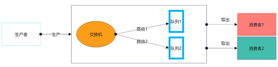

### 5.RabbitMQ安装

docker 安装：docker run -d --name rabbitmq -p 5672:5672 -p 15672:15672 rabbitmq:3.13-management

访问：http://192.168.159.129:15672/   账号密码：guest

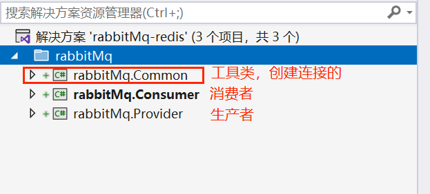

工具类：安装：RabbitMQ.Client包

```c#
using RabbitMQ.Client;

namespace rabbitMq.Common
{
    public class RabbitMqClient
    {
        public static IConnection GetConnection()
        {
            var factory = new ConnectionFactory()
            {
                HostName = "192.168.159.129",
                Port = 5672,
                UserName = "admin",
                Password = "admin",
                VirtualHost = "/"
            };
            return factory.CreateConnection();
        }
    }
}
```

### 6.RabbitMQ五种模式

#### 6.1.基本消息模型/点对点

生产者：

```c#
using rabbitMq.Common;
using RabbitMQ.Client;
using System.Text;

namespace rabbitMq.Provider.Helloword
{
    public class SendHelloword
    {
        public static void SendMessage()
        {
            //创建连接
            using (var connection = RabbitMqClient.GetConnection())
            {
                //创建信道
                using (var channel = connection.CreateModel())
                {
                    //定义队列
                    channel.QueueDeclare("Hwqueue", false, false, false, null);

                    int i = 0;
                    while (i < 10)
                    {
                        string content = $"这是第{i}条数据";
                        byte[] body = Encoding.UTF8.GetBytes(content);

                        //发送消息，exchange为空，会使用默认的交换机((AMQP default))
                        channel.BasicPublish(exchange: "", routingKey: "Hwqueue", null, body);

                        Console.WriteLine($"第{i}条数据发送完毕");
                        i++;
                    }
                }
            }
        }
    }
}
```

消费者

```c#
using rabbitMq.Common;
using RabbitMQ.Client;
using RabbitMQ.Client.Events;
using System.Text;

namespace rabbitMq.Consumer.Helloword
{
    public class ReceiveHelloword
    {
        public static void ReceiveMessage()
        {
            var connection = RabbitMqClient.GetConnection();
            var channel = connection.CreateModel();

            channel.QueueDeclare("Hwqueue", false, false, false, null);

            var consumer = new EventingBasicConsumer(channel);
            consumer.Received += (m, e) =>
            {
                string message = Encoding.UTF8.GetString(e.Body.ToArray());
                Console.WriteLine("已经处理消息：" + message);
            };

            channel.BasicConsume(queue: "Hwqueue", autoAck: true, consumer: consumer); //autoAck:true 自动确认消息
        }
    }
}
```

#### 6.2.消费者签收确认和拒收消息

点对点模式下的消费者是自动确认消息(autoAck: true)，在工作中一般不会自动确认消息，通常是手动确认消息，消费成功了，确认一条消息。如果一条消息既没有手动确认也没有自动确认，那么这条消息就会标注为“未确认状态”，过个几秒又会重新回到该队列中，等待消费。

消费者通常是以下三种情况：

1. 消费成功，手动确认签收消息
2. 消费失败，拒收消息

手动确认消息，则需要把autoAck设置未 false

演示1.消费成功，手动确认消息

```c#
using rabbitMq.Common;
using RabbitMQ.Client;
using RabbitMQ.Client.Events;
using System.Text;

namespace rabbitMq.Consumer.Helloword
{
    public class ReceiveHelloword
    {
        public static void ReceiveMessage()
        {
            var connection = RabbitMqClient.GetConnection();
            var channel = connection.CreateModel();

            channel.QueueDeclare("Hwqueue", false, false, false, null);

            var consumer = new EventingBasicConsumer(channel);
            consumer.Received += (m, e) =>
            {
                string message = Encoding.UTF8.GetString(e.Body.ToArray());
                Console.WriteLine("已经处理消息：" + message);

                //手动确认消息
                channel.BasicAck(e.DeliveryTag, multiple: false); //multiple批量处理消息
            };

            channel.BasicConsume(queue: "Hwqueue", autoAck: false, consumer: consumer); //autoAck:false
        }
    }
}

```

演示2.消费失败，拒收消息

> ​	channel.BasicReject(e.DeliveryTag, requeue: true);
>
> ​	requeue:拒收的消息是否要回到队列中去。
>
> ​		true：该条消息就会回到当前队列中，重新消费
>
> ​		false：该条消息就不会回到当前队列中

拒收的消息会去到死信队列里面去

```c#
using rabbitMq.Common;
using RabbitMQ.Client;
using RabbitMQ.Client.Events;
using System.Text;

namespace rabbitMq.Consumer.Helloword
{
    public class ReceiveHelloword
    {
        public static void ReceiveMessage()
        {
            var connection = RabbitMqClient.GetConnection();
            var channel = connection.CreateModel();

            channel.QueueDeclare("Hwqueue", false, false, false, null);

            var consumer = new EventingBasicConsumer(channel);
            consumer.Received += (m, e) =>
            {
                string message = Encoding.UTF8.GetString(e.Body.ToArray());
                Console.WriteLine("已经处理消息：" + message);

                //BasicReject 拒收消息
                channel.BasicReject(e.DeliveryTag, requeue: false);
            };

            channel.BasicConsume(queue: "Hwqueue", autoAck: false, consumer: consumer); //autoAck:false 
        }
    }
}
```

#### 6.3.工作队列消息模型

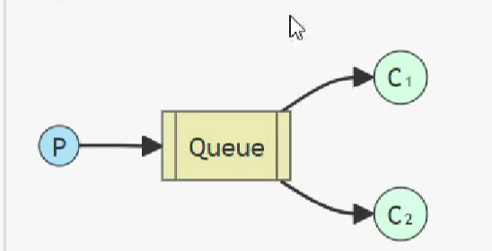

一个生产者(P)对应两个消费者(C1、C2)，C1、C2是竞争队列里面的消息，谁抢到算谁的，消费的消息不会重复。

生产者：

```c#
using rabbitMq.Common;
using RabbitMQ.Client;
using System.Text;

namespace rabbitMq.Provider.Workqueue
{
    public class SendWorkqueue
    {
        public static void SendMessage()
        {
            //创建连接
            using (var connection = RabbitMqClient.GetConnection())
            {
                //创建信道
                using (var channel = connection.CreateModel())
                {
                    //定义队列
                    channel.QueueDeclare("Workqueue", false, false, false, null);

                    int i = 0;
                    while (i < 500)
                    {
                        string content = $"这是第{i}条数据";
                        byte[] body = Encoding.UTF8.GetBytes(content);

                        //发送消息，exchange为空，会使用默认的交换机((AMQP default))
                        channel.BasicPublish(exchange: "", routingKey: "Workqueue", null, body);

                        Console.WriteLine($"第{i}条数据发送完毕");
                        i++;
                    }
                }
            }
        }
    }
}
```

C1、C2 

```c#
using RabbitMQ.Client.Events;
using rabbitMq.Common;
using System.Text;
using RabbitMQ.Client;

namespace rabbitMq.Consumer.Workqueue
{
    public class ReceiveWorkqueue
    {
        public static void ReceiveMessage()
        {
            var connection = RabbitMqClient.GetConnection();
            var channel = connection.CreateModel();

            channel.QueueDeclare("Workqueue", false, false, false, null);

            //prefetchSize:消息本身大小 如果设置为0，那么对消息本身大小不限制
            //prefetchCount:告诉rabbitMq不要一次性给消费者推送大于N个消息
            //global:是否将上面的设置应用于整个管道，false：只应用于当前消费者 true：当前通道所有消费者都应用这个限流策略
            channel.BasicQos(prefetchSize: 0, prefetchCount: 1, global: false);

            var consumer = new EventingBasicConsumer(channel);
            consumer.Received += (m, e) =>
            {
                string message = Encoding.UTF8.GetString(e.Body.ToArray());

                Thread.Sleep(100);

                Console.WriteLine("已经处理消息：" + message);

                channel.BasicAck(e.DeliveryTag, false);
            };

            channel.BasicConsume(queue: "Workqueue", autoAck: false, consumer: consumer); //autoAck:false 自动亲手
        }
    }
}

```

#### 6.4.发布/订阅(广播、扇形)模型fanout

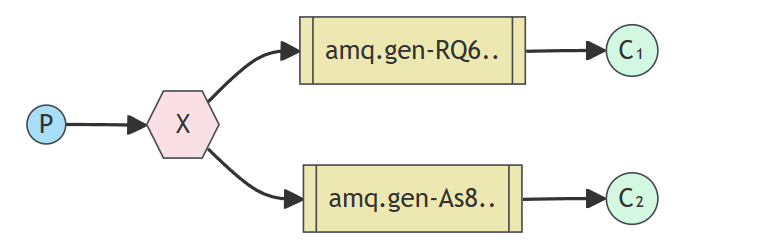

交换机给他下面所有的队列都发送消息，交换机类型：fanout（扇形模型）

生产者：

```c#
using rabbitMq.Common;
using RabbitMQ.Client;
using System.Text;

namespace rabbitMq.Provider.PublishSubscribe
{
    public class SendPublishSubscribe
    {
        public static void SendMessage()
        {
            //创建连接
            using (var connection = RabbitMqClient.GetConnection())
            {
                //创建信道
                using (var channel = connection.CreateModel())
                {
                    //定义交换机，fanout：扇形模式
                    channel.ExchangeDeclare("PublishSubscribe", "fanout");

                    //定义队列
                    channel.QueueDeclare("Publish1", false, false, false, null);
                    channel.QueueDeclare("Publish2", false, false, false, null);
                    channel.QueueDeclare("Publish3", false, false, false, null);

                    //将队列绑定到交换机上
                    channel.QueueBind("Publish1", "PublishSubscribe", "");
                    channel.QueueBind("Publish2", "PublishSubscribe", "");
                    channel.QueueBind("Publish3", "PublishSubscribe", "");

                    int i = 0;
                    while (i < 10)
                    {
                        string content = $"这是第{i}条数据";
                        byte[] body = Encoding.UTF8.GetBytes(content);

                        //给PublishSubscribe交换机下的所有队列都发送消息
                        channel.BasicPublish(exchange: "PublishSubscribe", routingKey: "", null, body);

                        Console.WriteLine($"第{i}条数据发送完毕");
                        i++;
                    }
                }
            }
        }
    }
}
```

消费者：

Publish1队列消费消息，Publish2、Publish3队列消息不会被消费

```c#
using RabbitMQ.Client.Events;
using rabbitMq.Common;
using System.Text;
using RabbitMQ.Client;

namespace rabbitMq.Consumer.PublishSubscribe
{
    public class ReceivePublishSubscribe
    {
        public static void ReceiveMessage()
        {
            var connection = RabbitMqClient.GetConnection();
            var channel = connection.CreateModel();
            //定义交换机
            channel.ExchangeDeclare("PublishSubscribe", "fanout");

            //定义队列
            channel.QueueDeclare("Publish1", false, false, false, null);
            channel.QueueDeclare("Publish2", false, false, false, null);
            channel.QueueDeclare("Publish3", false, false, false, null);

            //将队列绑定到交换机上
            channel.QueueBind("Publish1", "PublishSubscribe", "");
            channel.QueueBind("Publish2", "PublishSubscribe", "");
            channel.QueueBind("Publish3", "PublishSubscribe", "");

            var consumer = new EventingBasicConsumer(channel);
            consumer.Received += (m, e) =>
            {
                string message = Encoding.UTF8.GetString(e.Body.ToArray());
                Console.WriteLine("已经处理消息：" + message);

                channel.BasicAck(e.DeliveryTag, false);
            };
			
            //Publish1获取消息
            channel.BasicConsume(queue: "Publish1", autoAck: false, consumer: consumer); 
        }
    }
}
```


#### 6.5.路由模型（完全匹配模式）direct

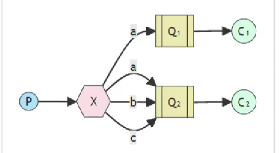

交换机根据路由key完全匹配规则向队列发送消息

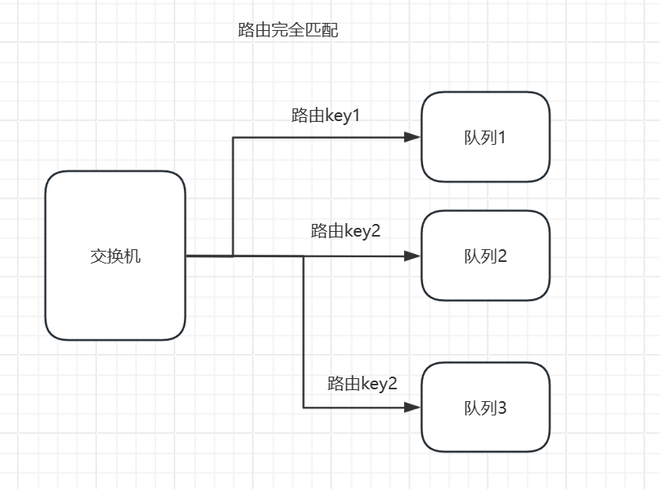


生产者：向路由key为`Routingkey3`的队列（`Routingqueue3`）发送消息

```c#
using rabbitMq.Common;
using RabbitMQ.Client;
using System.Text;

namespace rabbitMq.Provider.Routing
{
    public class SendRouting
    {
        public static void SendMessage()
        {
            //创建连接
            using (var connection = RabbitMqClient.GetConnection())
            {
                //创建信道
                using (var channel = connection.CreateModel())
                {
                    //定义交换机
                    channel.ExchangeDeclare("Routing", "direct");

                    //定义队列
                    channel.QueueDeclare("Routingqueue1", false, false, false, null);
                    channel.QueueDeclare("Routingqueue2", false, false, false, null);
                    channel.QueueDeclare("Routingqueue3", false, false, false, null);

                    //将队列绑定到交换机上
                    channel.QueueBind("Routingqueue1", "Routing", "Routingkey1");
                    channel.QueueBind("Routingqueue2", "Routing", "Routingkey2");
                    channel.QueueBind("Routingqueue3", "Routing", "Routingkey3");

                    int i = 0;
                    while (i < 10)
                    {
                        string content = $"这是第{i}条数据";
                        byte[] body = Encoding.UTF8.GetBytes(content);

                        //发送消息，向路由key为Routingkey3的队列发消息
                        channel.BasicPublish(exchange: "Routing", routingKey: "Routingkey3", null, body);

                        Console.WriteLine($"第{i}条数据发送完毕");
                        i++;
                    }
                }
            }
        }
    }
}
```

消费者：消费队列为Routingqueue3的消息

```c#
using rabbitMq.Common;
using RabbitMQ.Client;
using RabbitMQ.Client.Events;
using System.Text;

namespace rabbitMq.Consumer.Routing
{
    public class ReceiveRouting
    {
        public static void ReceiveMessage()
        {
            //创建连接
            var connection = RabbitMqClient.GetConnection();

            //创建信道
            var channel = connection.CreateModel();

            //定义交换机
            channel.ExchangeDeclare("Routing", "direct");

            //定义队列
            channel.QueueDeclare("Routingqueue1", false, false, false, null);
            channel.QueueDeclare("Routingqueue2", false, false, false, null);
            channel.QueueDeclare("Routingqueue3", false, false, false, null);

            //将队列绑定到交换机上
            channel.QueueBind("Routingqueue1", "Routing", "Routingkey1");
            channel.QueueBind("Routingqueue2", "Routing", "Routingkey2");
            channel.QueueBind("Routingqueue3", "Routing", "Routingkey3");

            var consumer = new EventingBasicConsumer(channel);
            consumer.Received += (m, e) =>
            {
                string content = Encoding.UTF8.GetString(e.Body.ToArray());

                Console.WriteLine("消费Routingkey3消息：" + content);

                channel.BasicAck(e.DeliveryTag, false);
            };

            channel.BasicConsume(queue: "Routingqueue3", false, consumer);
        }
    }
}

```


#### 6.6.主题模型（关键字模式）topic

交换机根据路由key模糊匹配规则向队列发送消息

生产者：

> ​	*：通配符，匹配一个单词
>
> ​	#：匹配一个或者多个单词
>
> ​    Routingkey.abc都会匹配上Routingkey.* 、Routingkey.# ，所以队列 topicqueue1、topicqueue2 都会有消息

```c#
using rabbitMq.Common;
using RabbitMQ.Client;
using System.Text;

namespace rabbitMq.Provider.Topic
{
    public class SendTopic
    {
        public static void SendMessage()
        {
            //创建连接
            using (var connection = RabbitMqClient.GetConnection())
            {
                //创建信道
                using (var channel = connection.CreateModel())
                {
                    //定义交换机
                    channel.ExchangeDeclare("topicExchange", "topic");

                    //定义队列
                    channel.QueueDeclare("topicqueue1", false, false, false, null);
                    channel.QueueDeclare("topicqueue2", false, false, false, null);

                    //将队列绑定到交换机上
                    channel.QueueBind("topicqueue1", "topicExchange", "Routingkey.*");
                    channel.QueueBind("topicqueue2", "topicExchange", "Routingkey.#");

                    int i = 0;
                    while (i < 10)
                    {
                        string content = $"这是第{i}条数据";
                        byte[] body = Encoding.UTF8.GetBytes(content);

                        //发送消息，向路由key为Routingkey3的队列发消息
                        channel.BasicPublish(exchange: "topicExchange", routingKey: "Routingkey.abc", null, body);

                        Console.WriteLine($"第{i}条数据发送完毕");
                        i++;
                    }
                }
            }
        }
    }
}

```

消费者：

```c#
using RabbitMQ.Client.Events;
using rabbitMq.Common;
using System.Text;
using RabbitMQ.Client;

namespace rabbitMq.Consumer.Topic
{
    public class ReceiveTopic
    {
        public static void ReceiveMessage()
        {
            //创建连接
            var connection = RabbitMqClient.GetConnection();

            //创建信道
            var channel = connection.CreateModel();

            //定义交换机
            channel.ExchangeDeclare("topicExchange", "topic");

            //定义队列
            channel.QueueDeclare("topicqueue1", false, false, false, null);
            channel.QueueDeclare("topicqueue2", false, false, false, null);

            //将队列绑定到交换机上
            channel.QueueBind("topicqueue1", "topicExchange", "Routingkey.*");
            channel.QueueBind("topicqueue2", "topicExchange", "Routingkey.#");

            var consumer = new EventingBasicConsumer(channel);
            consumer.Received += (m, e) =>
            {
                string content = Encoding.UTF8.GetString(e.Body.ToArray());

                Console.WriteLine("消费topicqueue1队列消息：" + content);

                channel.BasicAck(e.DeliveryTag, false);
            };

            channel.BasicConsume(queue: "topicqueue1", false, consumer);
        }
    }
}

```

### 7.rabbitMq的持久化

持久化：把没有确认签收的消息保存到磁盘里，

#### 7.1.持久化概念

1、内存到磁盘。保证:消息确认签收之前，不能丢。

2、<font style="color:red;">要做到消息持久化，必须：交换机、队列、消息都要持久化。</font>

3、持久化的交换机可以绑定没有持久化的队列；持久化的队列里可以放非持久化消息


#### 7.2.非持久化概念

能持久化，但是一般不做。内存快耗尽的时候进行持久化


#### 7.3.交换机/队列持久化

1. 交换机持久化

   ```c#
   //定义交换机 durable:true 持久化
   channel.ExchangeDeclare("topicExchange", type: "topic", durable: true);
   ```

2. 队列持久化

   ```c#
   //定义队列 durable:true 持久化
   channel.QueueDeclare("topicqueue1", durable: true, false, false, null);
   channel.QueueDeclare("topicqueue2", durable: true, false, false, null);
   ```

3. 消息持久化

   ```c#
   var prop = channel.CreateBasicProperties();
   prop.Persistent = true; //消息持久化
   
   int i = 0;
   while (i < 10)
   {
       string content = $"这是第{i}条数据";
       byte[] body = Encoding.UTF8.GetBytes(content);
   
       //发送消息，向路由key为Routingkey3的队列发消息 prop消息持久化
       channel.BasicPublish(exchange: "topicExchange", routingKey: "Routingkey.abc", prop, body);
   
       Console.WriteLine($"第{i}条数据发送完毕");
       i++;
   }
   ```

生产者:

```c#
using rabbitMq.Common;
using RabbitMQ.Client;
using System.Text;

namespace rabbitMq.Provider.Topic
{
    public class SendTopic
    {
        public static void SendMessage()
        {
            //创建连接
            using (var connection = RabbitMqClient.GetConnection())
            {
                //创建信道
                using (var channel = connection.CreateModel())
                {
                    //定义交换机
                    channel.ExchangeDeclare("topicExchange", type: "topic", durable: true);

                    //定义队列
                    channel.QueueDeclare("topicqueue1", durable: true, false, false, null);
                    channel.QueueDeclare("topicqueue2", durable: true, false, false, null);

                    //将队列绑定到交换机上
                    channel.QueueBind("topicqueue1", "topicExchange", "Routingkey.*");
                    channel.QueueBind("topicqueue2", "topicExchange", "Routingkey.#");


                    var prop = channel.CreateBasicProperties();
                    prop.Persistent = true; //消息持久化
                    int i = 0;
                    while (i < 10)
                    {
                        string content = $"这是第{i}条数据";
                        byte[] body = Encoding.UTF8.GetBytes(content);

                        //发送消息，向路由key为Routingkey3的队列发消息
                        channel.BasicPublish(exchange: "topicExchange", routingKey: "Routingkey.abc", prop, body);

                        Console.WriteLine($"第{i}条数据发送完毕");
                        i++;
                    }
                }
            }
        }
    }
}
```


### 8.死信队列

> ​	无法消费的消息。一般来说，生产者将消息发送到队列中，消费者从队列中取出消息进行消费，但有时候由于特定原因，导致某些消息无法被消费，这些消息如果后续没有处理，就变成了死信，有死信自然就有了死信队列。

```shell
应用场景:为了保证订单业务的消息数据不丢失，需要使用到RabbitMQ的死信队列机制，当消息消费发生异常时，将消息投入死信队列中。还有比如说:用户在商城下单成功并点击去支付后在指定时间未支付时自动失效。
```

#### 8.1.来源

1、消息TTL过期(Time To Live 存活时长)

2、队列达到最大长度(队列满了，无法再添加数据到mq中)

3、消息被拒绝(basic.reject或 basic.nack)并且requeue=false(不放回队列)

#### 8.2.实现流程

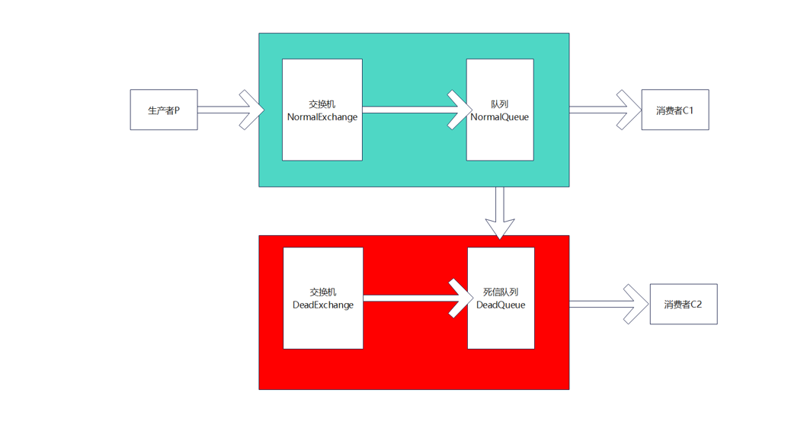

##### 8.2.1.消息TTL过期(Time To Live 存活时长)

> ​	场景：30分钟订单未支付

生产者：

```c#
using rabbitMq.Common;
using RabbitMQ.Client;
using System.Text;

namespace rabbitMq.Provider.Dead
{
    public class SendDead
    {
        public static void SendMessage()
        {
            var connection = RabbitMqClient.GetConnection();
            var channel = connection.CreateModel();

            //正常交换机、正常队列、正常路由
            string normalExchange = "normalExchange";
            string normalQueue = "normalQueue";
            string normalKey = "normalKey";
            //死信交换机、死信队列、死信路由
            string deadExchange = "deadExchange";
            string deadQueue = "deadQueue";
            string deadKey = "deadKey";

            //声明正常
            channel.ExchangeDeclare(normalExchange, type: "direct", durable: true);
            Dictionary<string, object> arg = new Dictionary<string, object>();
            arg.Add("x-dead-letter-exchange", deadExchange);//死信交换机
            arg.Add("x-dead-letter-routing-key", deadKey);//死信路由
            channel.QueueDeclare(normalQueue, durable: true, false, false, arg);
            channel.QueueBind(normalQueue, normalExchange, normalKey);

            //声明死信
            channel.ExchangeDeclare(deadExchange, type: "direct", durable: true);
            channel.QueueDeclare(deadQueue, durable: true, false, false, null);
            channel.QueueBind(deadQueue, deadExchange, deadKey);

            //向正常队列发送消息
            var prop = channel.CreateBasicProperties();
            prop.Expiration = "10000"; //过期事件 毫秒 10s过期
            int i = 0;
            while (i < 10)
            {
                string content = $"死信消息，第{i}条消息";
                byte[] body = Encoding.UTF8.GetBytes(content);

                channel.BasicPublish(normalExchange, normalKey, prop, body);

                i++;
            }
        }
    }
}
```

消费者：

正常队列消费：channel.BasicConsume(normalQueue, false, consumer);

死信队列消费：channel.BasicConsume(deadQueue, false, consumer);

```c#
using rabbitMq.Common;
using RabbitMQ.Client;
using RabbitMQ.Client.Events;
using System.Text;

namespace rabbitMq.Consumer.Dead
{
    public class ReceiveDead
    {
        public static void ReceiveMessage()
        {
            var connection = RabbitMqClient.GetConnection();
            var channel = connection.CreateModel();

            //正常交换机、正常队列、正常路由
            string normalExchange = "normalExchange";
            string normalQueue = "normalQueue";
            string normalKey = "normalKey";
            //死信交换机、死信队列、死信路由
            string deadExchange = "deadExchange";
            string deadQueue = "deadQueue";
            string deadKey = "deadKey";

            //声明正常
            channel.ExchangeDeclare(normalExchange, type: "direct", durable: true);
            Dictionary<string, object> arg = new Dictionary<string, object>();
            arg.Add("x-dead-letter-exchange", deadExchange);//死信交换机
            arg.Add("x-dead-letter-routing-key", deadKey);//死信路由
            channel.QueueDeclare(normalQueue, durable: true, false, false, arg);
            channel.QueueBind(normalQueue, normalExchange, normalKey);

            //声明死信
            channel.ExchangeDeclare(deadExchange, type: "direct", durable: true);
            channel.QueueDeclare(deadQueue, durable: true, false, false, null);
            channel.QueueBind(deadQueue, deadExchange, deadKey);

            var consumer = new EventingBasicConsumer(channel);
            consumer.Received += (m, e) =>
            {
                string content = Encoding.UTF8.GetString(e.Body.ToArray());
                Console.WriteLine(content);

                channel.BasicAck(e.DeliveryTag, false);
            };

            //消费正常队列消息
            //channel.BasicConsume(normalQueue, false, consumer);

            //消费死信队列消息
            channel.BasicConsume(deadQueue, false, consumer);
        }
    }
}
```

##### 8.2.2.队列达到最大长度(队列满了，无法再添加数据到mq中)

> ​	案例：抢票

生产者：arg.Add("x-max-length", 10);//最大容量

```c#
using rabbitMq.Common;
using RabbitMQ.Client;
using System.Text;

namespace rabbitMq.Provider.Dead
{
    public class SendDead
    {
        public static void SendMessage()
        {
            var connection = RabbitMqClient.GetConnection();
            var channel = connection.CreateModel();

            //正常交换机、正常队列、正常路由
            string normalExchange = "normalExchange";
            string normalQueue = "normalQueue";
            string normalKey = "normalKey";
            //死信交换机、死信队列、死信路由
            string deadExchange = "deadExchange";
            string deadQueue = "deadQueue";
            string deadKey = "deadKey";

            //声明正常
            channel.ExchangeDeclare(normalExchange, type: "direct", durable: true);
            Dictionary<string, object> arg = new Dictionary<string, object>();
            arg.Add("x-dead-letter-exchange", deadExchange);//死信交换机
            arg.Add("x-dead-letter-routing-key", deadKey);//死信路由
            arg.Add("x-max-length", 10);//最大容量
            channel.QueueDeclare(normalQueue, durable: true, false, false, arg);
            channel.QueueBind(normalQueue, normalExchange, normalKey);

            //声明死信
            channel.ExchangeDeclare(deadExchange, type: "direct", durable: true);
            channel.QueueDeclare(deadQueue, durable: true, false, false, null);
            channel.QueueBind(deadQueue, deadExchange, deadKey);

            //向正常队列发送消息
            var prop = channel.CreateBasicProperties();
            prop.Expiration = "10000"; //过期事件 毫秒 10s过期
            int i = 0;
            while (i < 15)
            {
                string content = $"死信消息，第{i}条消息";
                byte[] body = Encoding.UTF8.GetBytes(content);

                channel.BasicPublish(normalExchange, normalKey, prop, body);

                i++;
            }
        }
    }
}
```

##### 8.2.3.消息被拒绝(basic.reject或 basic.nack)并且requeue=false(不放回队列)

> ​	消费者出现异常，拒收该消息
>
> ​	channel.BasicReject(e.DeliveryTag,requeue: false);

消费者：

```c#
using rabbitMq.Common;
using RabbitMQ.Client;
using RabbitMQ.Client.Events;
using System.Text;

namespace rabbitMq.Consumer.Dead
{
    public class ReceiveDead
    {
        public static void ReceiveMessage()
        {
            var connection = RabbitMqClient.GetConnection();
            var channel = connection.CreateModel();

            //正常交换机、正常队列、正常路由
            string normalExchange = "normalExchange";
            string normalQueue = "normalQueue";
            string normalKey = "normalKey";
            //死信交换机、死信队列、死信路由
            string deadExchange = "deadExchange";
            string deadQueue = "deadQueue";
            string deadKey = "deadKey";

            //声明正常
            channel.ExchangeDeclare(normalExchange, type: "direct", durable: true);
            Dictionary<string, object> arg = new Dictionary<string, object>();
            arg.Add("x-dead-letter-exchange", deadExchange);//死信交换机
            arg.Add("x-dead-letter-routing-key", deadKey);//死信路由
            arg.Add("x-max-length", 10);//最大容量
            channel.QueueDeclare(normalQueue, durable: true, false, false, arg);
            channel.QueueBind(normalQueue, normalExchange, normalKey);

            //声明死信
            channel.ExchangeDeclare(deadExchange, type: "direct", durable: true);
            channel.QueueDeclare(deadQueue, durable: true, false, false, null);
            channel.QueueBind(deadQueue, deadExchange, deadKey);

            var consumer = new EventingBasicConsumer(channel);
            consumer.Received += (m, e) =>
            {
                string content = Encoding.UTF8.GetString(e.Body.ToArray());
                Console.WriteLine(content);

                //拒收，requeue: false 不返回原来的队列
                channel.BasicReject(e.DeliveryTag,requeue: false);
            };

            //消费正常队列消息
            channel.BasicConsume(normalQueue, false, consumer);
        }
    }
}

```

### 9.延时队列

> ​	[延迟队列](https://so.csdn.net/so/search?q=延迟队列&spm=1001.2101.3001.7020)存储的对象是对应的延迟消息，所谓“延迟消息”是指当消息被发送以后，并不想让消费者立刻拿到消息，而是等待特定时间后，消费者才能拿到这个消息进行消费。

#### 9.1.应用场景

1、订单处理：在电商网站中，订单处理是一个常见的业务流程。如果订单需要立即处理，可以使用RabbitMQ的延时队列来实现延迟处理。例如，可以将订单发送到一个延时队列中，并设置一个延迟时间(例如30分钟),然后在延迟时间到达后，将订单从队列中取出并进行处理。

2、消息推送：在移动应用或Web应用程序中，可以使用RabbitMQ的延时队列来实现消息推送。例如，可以将用户订阅的消息发送到一个延时队列中，并设置一个延迟时间(例如1小时),然后在延迟时间到达后，将消息从队列中取出并推送给用户。

3、定时任务：在分布式系统中，可以使用RabbitMQ的延时队列来实现定时任务。例如，可以将需要定期执行的任务发送到一个延时队列中，并设置一个延迟时间(例如每天),然后在延迟时间到达后，将任务从队列中取出并执行。

4、数据备份：在数据库中，可以使用RabbitMQ的延时队列来实现数据备份。例如，可以将需要备份的数据发送到一个延时队列中，并设置一个延迟时间(例如每天),然后在延迟时间到达后，将数据从队列中取出并进行备份。

5、优惠券发放：您可以设置一个延时队列，将优惠券发放任务添加到队列中，设置一定的延时时间，以保证优惠券在特定时间后才能被消费。

#### 9.2.安装rabbitmq延时插件

1. 将插件文件复制到linux系统中

2. 将插件文件复制到docker容器

   ```sh
   docker cp rabbitmq_delayed_message_exchange-3.13.0.ez d16d6c5d7780:/opt/rabbitmq/plugins/rabbitmq_delayed_message_exchange-3.13.0.ez
   ```

3. 进入rabbitMq容器内部：docker exec -it rabbitmq bash

4. 启用插件：rabbitmq-plugins enable rabbitmq_delayed_message_exchange

#### 9.3.代码实现延迟队列

> ​	原理：消息不会马上进入到队列里面来，而是保存到交换机里，等过了延迟时间，消息就会发送到消息队列里面去。消费者就会消费队列里的消息

生产者：

```c#
using rabbitMq.Common;
using RabbitMQ.Client;
using System.Text;

namespace rabbitMq.Provider.Delay
{
    public class SendDelay
    {
        public static void SendMessage()
        {
            var connection = RabbitMqClient.GetConnection();
            var channel = connection.CreateModel();

            channel.ExchangeDeclare(
                exchange: "delayExchange",
                type: "x-delayed-message",
                durable: true,
                autoDelete: false, 
                arguments: new Dictionary<string, object>
                {
                    {"x-delayed","direct" }
                });

            channel.QueueDeclare("delayQueue", true, false, false, null);

            channel.QueueBind("delayQueue", "delayExchange", "delayKey");

            var prop = channel.CreateBasicProperties();
            prop.Headers = new Dictionary<string, object>
            {
                {"x-delay","15000" } //延时15s
            };
            string content = "这是一个延时30s的消息";
            byte[] body = Encoding.UTF8.GetBytes(content);

            channel.BasicPublish("delayExchange", "delayKey", prop, body);
        }
    }
}
```

### 10.集群

> ​	解决高并发，达到高可用

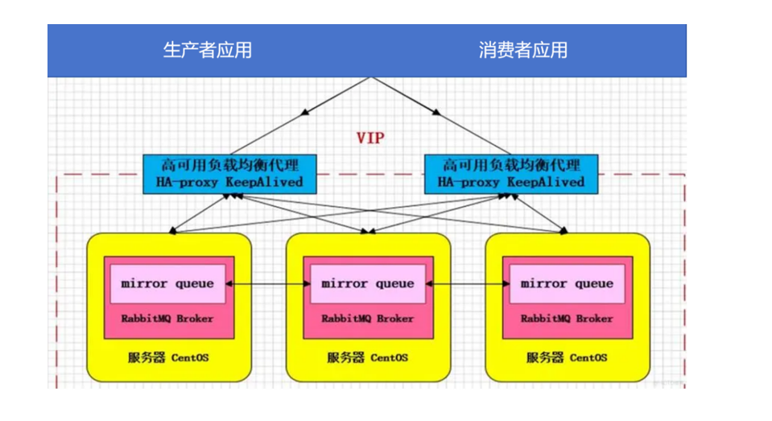


## 二、redis

### 1.数据类型

#### 1.1.string 类型
